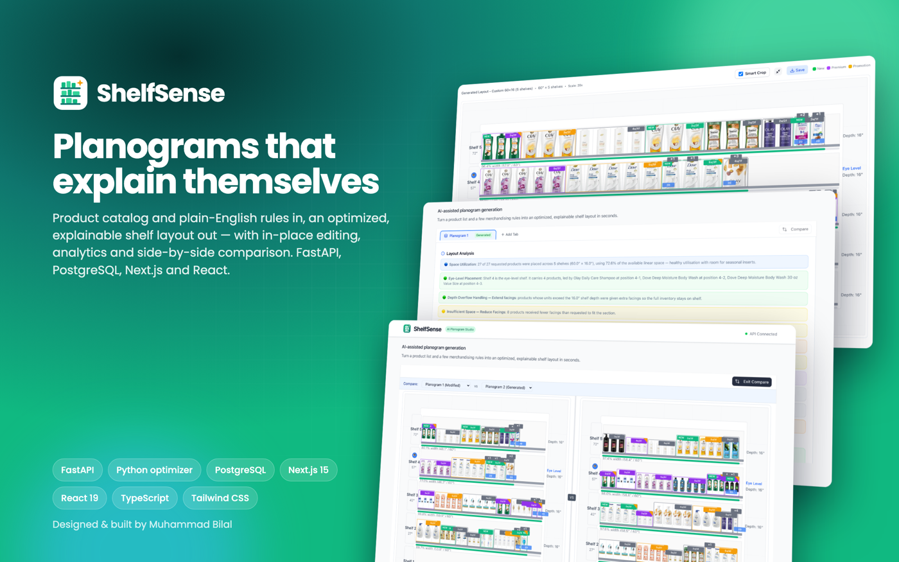
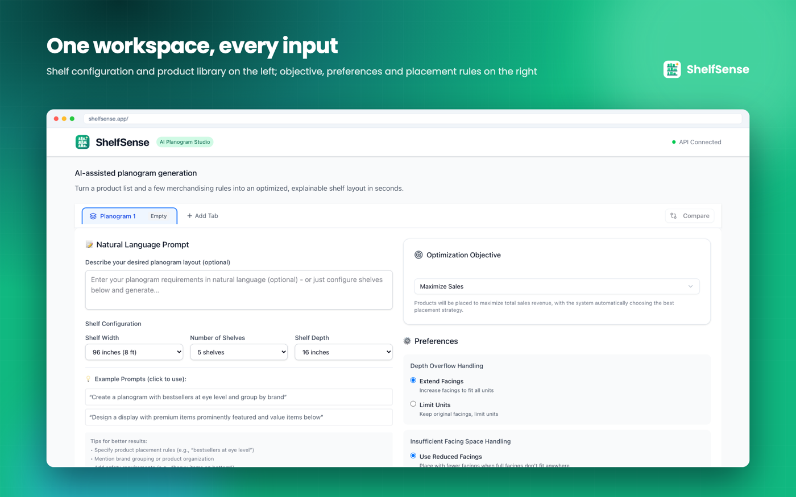
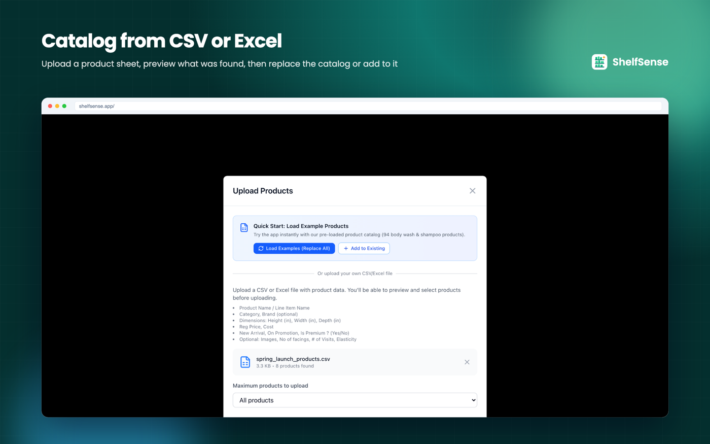
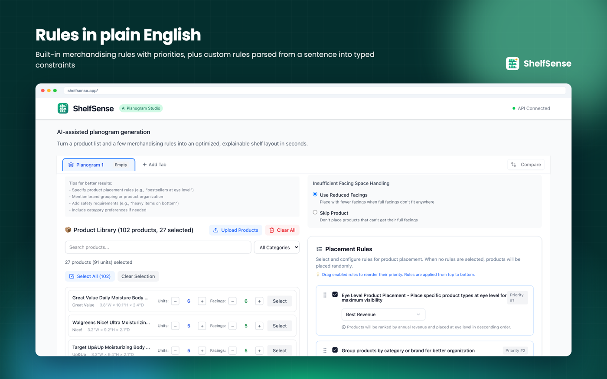
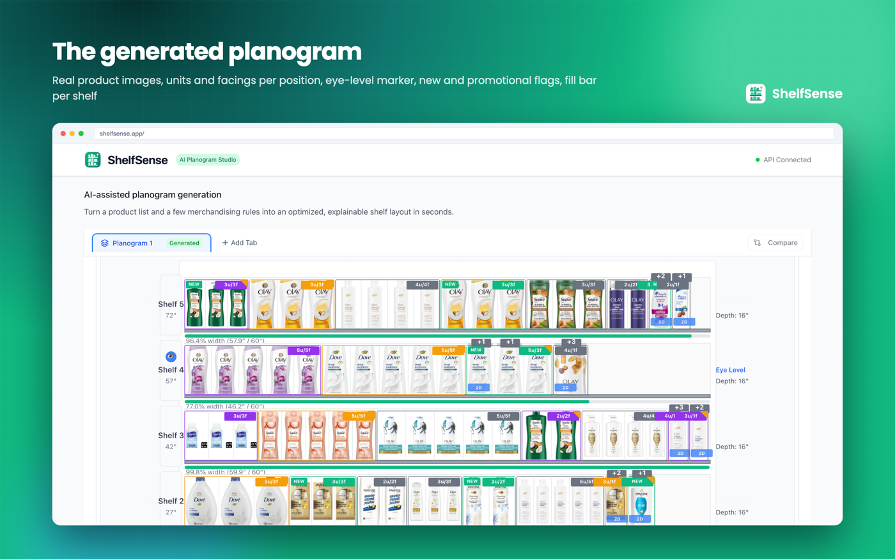
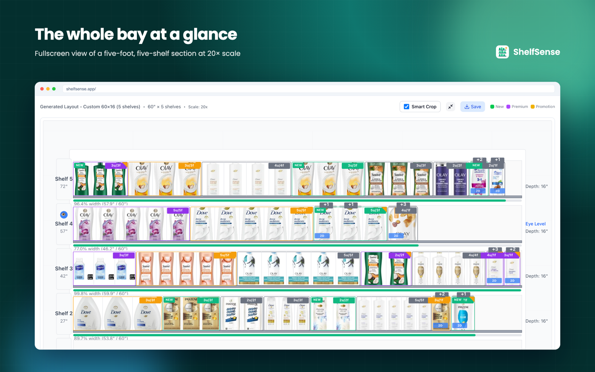
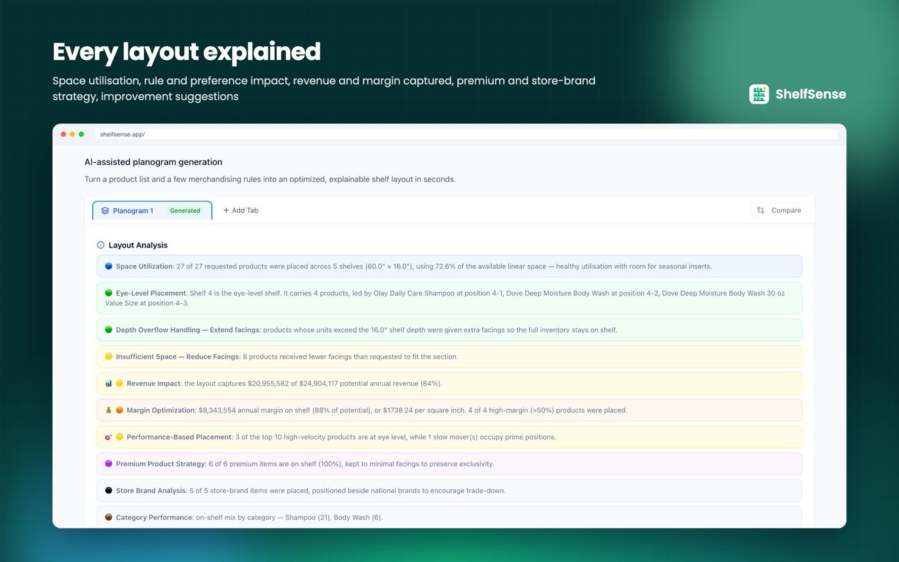
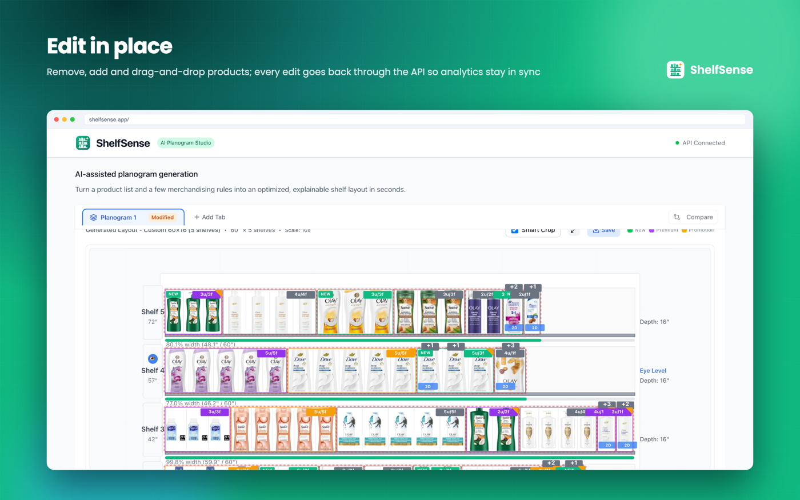
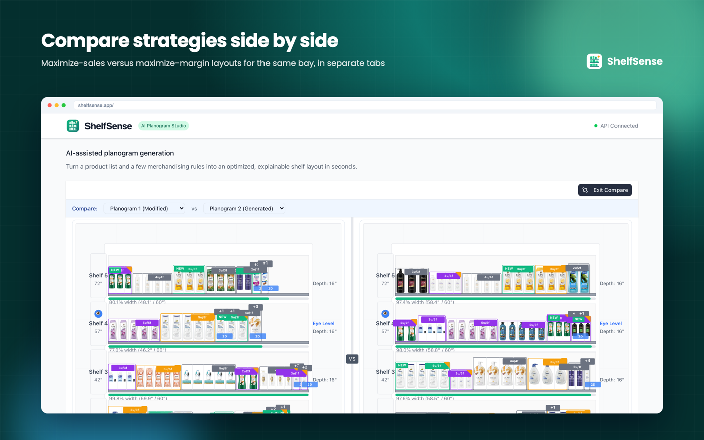

# ShelfSense

**An AI planogram studio.** Turns a product catalog and a few merchandising rules into an optimized, explainable retail shelf layout in seconds — with the reasoning attached, so a category manager can defend it.

  
  
  
  
  
  
  
  

**My role:** everything — product design, data model, optimizer, API, agents, front end, Docker setup, tests and this demo.

---

## Demo

<!--
  TO FINISH: drag shelfsense-demo.mp4 (in this folder, gitignored) into the GitHub
  web editor for this README. GitHub uploads it and leaves a user-attachments URL
  here, which renders as an inline video player. Then delete this comment.
-->

---

## The problem

Category managers still build planograms by hand in spreadsheets and drawing tools, and a single bay can take days to lay out, justify and revise. ShelfSense was my answer to that: describe the bay, pick the products, state the rules, and get a layout you can defend.

---

## What it does

### Catalog in seconds

Upload a CSV or Excel sheet, preview what was found, then replace the catalog or add to it. Products carry dimensions, price and cost, sales history, flags (new arrival, promotion, premium, store brand) and images. A bundled 94-product personal-care catalog gets you started.

### The brief, and merchandising rules

Choose the bay (36–96 inches, 1–8 shelves, 12–24 inches deep), the objective (maximize sales or margin) and how the optimizer should handle depth overflow and tight space. Then state the rules: best sellers at eye level (ranked by units, revenue, margin or a product flag), category or brand blocking, highlighting new and promotional lines — with drag-to-reorder priorities.

**Rules can be written in plain English.** "Place Head & Shoulders on the top shelf", "Keep Dove and Suave brands separated", "Give Dove Deep Moisture at least 4 facings". The parser turns the sentence into a typed constraint, validates it against the catalog, shows its confidence, and the optimizer enforces it.

### An explainable planogram

The bay renders with real product images, units and facings per position, an eye-level marker, flags and a fill bar per shelf.

Fullscreen mode for reviewing a bay properly:

Every layout ships with an analysis: space utilisation, how each rule and preference shaped the result, the revenue and margin captured, premium and store-brand strategy, anomalies and a concrete improvement suggestion. A metrics panel projects weekly sales and margin per shelf.

### Edit in place

Remove a product (shift neighbours or keep the gap), add one (to the end, into a gap, or centred), drag products to new positions, eliminate gaps — every edit goes back through the API, so the analytics stay honest instead of drifting out of sync with the layout.

### Versions and comparison

Tabs per planogram, JSON export and import, a change analysis with a rationale for every moved SKU, and a compare mode that puts two strategies side by side.

---

## How it's built

The backend follows a clean architecture: domain entities (products, shelves, placements, rules), application use cases (prompt parser, layout optimizer, shelf analytics, sales estimator), infrastructure (agents, PostgreSQL repository) and a FastAPI presentation layer with 19 typed endpoints.

**The optimizer is plain Python.** Shelf physics, facings, depth stacking, objectives and rule priorities are solved deterministically — so results are reproducible and generation takes milliseconds, rather than depending on a model to place products correctly.

Three analyst agents (explanation, change analysis, rule parsing) run on an LLM when an API key is configured and on a built-in rule-based analyst otherwise, so the product works out of the box with no key.

The studio is Next.js 15 with React 19 and TypeScript. The shelf is a custom SVG renderer with smart image cropping, fullscreen mode, drag-and-drop via dnd-kit, and a tab manager whose workspace survives a refresh. Docker Compose runs the whole stack; pytest covers the optimizer and API.

---

## Stack

**Backend** — Python 3.12, FastAPI, Pydantic, SQLAlchemy, PostgreSQL, pytest
**Frontend** — Next.js 15, React 19, TypeScript, Tailwind CSS, Radix UI, dnd-kit
**Infra** — Docker, Docker Compose

---

## A note on the source

The source for this project is private. This repository is the case study — screenshots, architecture and a walkthrough video. Happy to talk through the implementation on a call.

[Back to my profile →](https://github.com/billybutt60)
